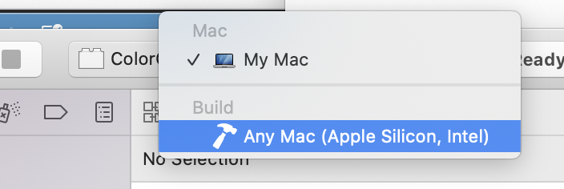

# Apple Silicon Support

Adobe now supports Apple Silicon effect plugins in some products running natively on Apple Silicon. For instance, After Effects effect plugins are also available in Adobe Premiere Pro and Adobe Media Encoder.

Not all Adobe products have native Apple Silicon versions yet, but in those that do, only effect plugins with Apple Silicon implementations will be available. We recommend adding the Apple Silicon target soon in anticipation of rapid adoption of these new M1 machines.

!!! note
    In order to build a Mac Universal binary, you will need Xcode 12.2 or greater.

To learn more about Universal binaries, please visit [https://developer.apple.com/documentation/apple-silicon/building-a-universal-macos-binary](https://developer.apple.com/documentation/apple-silicon/building-a-universal-macos-binary)

Loading plugins on macOS 15+ for debugging also requires an additional signing step. See [here](debugging-plug-ins.md#signing-requirments-and-loading-unsigned-plug-ins) for details.

---

## How to add Universal Binary Support for your Plugins

1. Open your plugins Xcode project in 12.2 or above and Xcode will automatically add an Apple Silicon target for you.


*Mac Universal Build*

1. Tell After Effects what the main entry point is for Apple Silicon builds.

> * Find the .r resource file for your plugin.
> * Add `CodeMacARM64 {"EffectMain"}` next to your existing Intel Mac entry point definition.
>   ```cpp
>   #if defined(AE_OS_MAC)
>     CodeMacARM64 {"EffectMain"},
>     CodeMacIntel64 {"EffectMain"},
>   #endif
>   ```
> * If for some reason you need different entry points on x64 and ARM just provide a different entry point name and string.

3. Compile the Universal binary by building for the Any Mac (Apple Silicon, Intel) Target, or by using Product -> Archive.

Assuming there are no compile time issues with the Apple Silicon build, you can now use the single Universal binary for both Intel and Apple Silicon applications.

---

## Exception Behavior with Apple Silicon Across "C" Functions

Extra care should be taken when using exceptions on Apple Silicon. In many environments throwing exceptions that propagate through traditional "C" functions worked fine. It was bad practice, with undefined behavior, but generally "worked".

On Apple Silicon, rather than undefined behavior the ABI has changed so terminate() is called when this occurs.

Since the main entry point of a plugin is always an extern "C" calling convention, this code should be wrapped in a try/catch block to prevent program termination. For example:

```cpp
PF_Err EffectMain ( PF_Cmd cmd,
    PF_InData *in_data,
    PF_OutData *out_data,
    PF_ParamDef *params[],
    PF_LayerDef *output )
{
    try
    {
        /* Your code here */
    }
    catch
    {
        /* return most appropriate PF_Err */
    }
}
```
