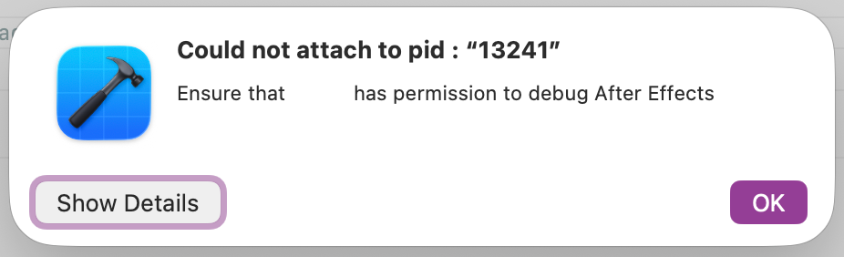

# Attaching a debugger to After Effects on macOS

## Debugging against After Effects Beta 2027+

Starting with After Effects 2027, official Beta builds on macOS require **developer mode** to be enabled before a debugger can attach to the running application. This replaces the previous behavior where Beta builds could always be attached to directly.

Official non-Beta/LTS builds do not support developer mode. See [Debugging against a non-Beta build on macOS](#debugging-against-a-non-beta-build-on-macos-starting-in-ae-265) below for the re-signing workflow required there instead.

### Enabling developer mode

Developer mode is granted per-machine and requires administrator access to set up. Open Terminal and run:

```
sudo mkdir -p "/Library/Application Support/Adobe/After Effects (Beta)"
sudo touch "/Library/Application Support/Adobe/After Effects (Beta)/developer-mode"
```

You'll be prompted for your administrator password. The contents of this file don't matter — only its presence.

Once created, developer mode applies to any installed Beta build on that machine — you do not need to repeat this for every new Beta release, and you do not need to remove or recreate it when After Effects updates.

To disable developer mode again:

```
sudo rm "/Library/Application Support/Adobe/After Effects (Beta)/developer-mode"
```

### Attaching your debugger

With developer mode enabled, attach to a running Beta build exactly as before:

```
lldb -p <pid>
```

or attach from Xcode using **Debug > Attach to Process**.

---

## Debugging against a non-Beta build on macOS starting in AE 26.5

Official non-Beta/LTS builds do not support developer mode. Because of the code signing of the After Effects application, starting in 26.5, Xcode will show an error dialog like the one below when you try to attach to a running non-Beta build:



To debug against one of these builds, re-sign a development copy with the `get-task-allow` entitlement:

1. Make a copy of the entire After Effects installation folder and call it `Adobe After Effects-developer` (this example pastes it next to the default installation folder).

2. Open Terminal and ensure your current directory is writable (such as your home folder), then dump the app's entitlements to a file:

    ```
    codesign -d --xml --entitlements entitlements.xml "/Applications/Adobe After Effects-developer/Adobe After Effects 2026.app"
    ```

3. Open the `entitlements.xml` generated in step 2 and remove any characters before `<?xml`.

4. Add the following to the entitlements:

    ```xml
    <key>com.apple.security.get-task-allow</key>
    <true/>
    ```

5. Re-sign the development copy with the edited entitlements:

    ```
    codesign -f -s - --entitlements entitlements.xml "/Applications/Adobe After Effects-developer/Adobe After Effects 2026.app"
    ```

6. Launch the re-signed copy and attach your debugger as usual.

### Notes

- You'll need to repeat this process each time you want to debug against a newer non-Beta build.
- The name of the After Effects application will need to be changed when version 2027 is released (Adobe After Effects 2027.app)
